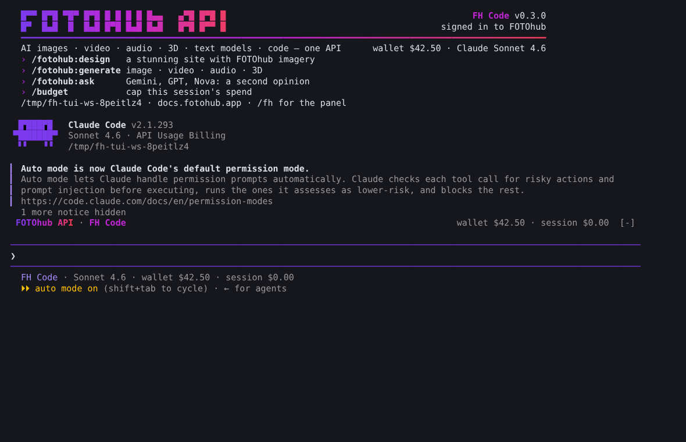

# FH Code (FOTOhub Code)



FH Code is Claude Code running on the FOTOhub API. You get the same terminal interface, agents, plugins, MCP and hooks, but every turn is billed to the prepaid wallet of your [fotohub.app](https://fotohub.app) account, within that account's limits.

On top of Claude Code, FH Code adds:

- the FOTOhub look: the FOTOhub API hero at the top of the terminal, a violet theme, a status line with the wallet, start-up notes and tips,
- `/login` and `/logout` for your FOTOhub account (browser sign-in), and `/budget` for the session's spend,
- FOTOhub's other text models: Gemini, GPT-5.1 and Nova for second opinions, comparisons and copy (`/fotohub:ask`, `/fotohub:compare`, `/fotohub:second-opinion`, `fhcode ask`), and the Agent Compute models (Grok, DeepSeek, Kimi, Qwen) in `fhcode models`,
- media spend tracking and an asset library for everything generated (`fhcode assets`),
- design mode (`/fotohub:design`): stunning sites with original imagery from FOTOhub's 40+ image models, plus brand kits and web asset sets,
- the built-in `fotohub` plugin: skills, `/fotohub:*` commands and agents for building on the FOTOhub API,
- code intelligence: language servers for TS/JS, Python, Go, Rust and PHP, with `fhcode doctor` and `fhcode setup` for every dependency,
- FOTOhub's MCP tools for image, video, audio, 3D, storage, pricing and the wallet,
- a docs.fotohub.app search,
- an agent hub for background agents, with follow-ups and a cost ledger (`fhcode usage`),
- updates from FOTOhub.

```bash
curl -fsSL https://claude.ai/install.sh | bash        # the Claude Code engine
npm install -g https://github.com/fotohubapp/Fh-code/releases/latest/download/fh-code.tgz
fhcode login                                           # API key from https://fotohub.app/settings/api
cd your-project && fhcode
```

| Area | In FH Code |
|------|------------|
| Coding | The full Claude Code terminal experience, on FOTOhub models (Sonnet 4.6, 4.5, 4, Haiku 4.5), with diagnostics from language servers after every edit |
| Other models | Gemini 2.5 Flash/Pro, GPT-5.1, Nova and Claude chat through `fotohub_ask_model` and `fotohub_compare_models`; Agent Compute models listed by `fhcode models` |
| Media | Every FOTOhub generation counted in the session, the ledger and the asset library (`fhcode assets`, dashboard gallery) |
| Design | `/fotohub:design`, `/fotohub:brand`, `/fotohub:assets`, and the "FOTOhub Design" output style |
| Agents | Claude Code subagents, plus the FH Code hub: `fhcode agents run`, `fhcode hub` dashboard |
| FOTOhub | Built-in `fotohub` MCP server; `fh-code` MCP server with docs.fotohub.app, wallet, packages and hub |
| Integrations | Any MCP server, and plugins from the `fh-code-plugins` marketplace (this repository) |
| Account | Wallet, monthly limit and session budget (`/budget`) checked before every turn; cost in the status line |
| Updates | `fhcode update` from FOTOhub releases |
| IDE | `fhcode gateway` for the Claude Code IDE extensions |
| No engine? | `fhcode lite`: FH Code's own agent |

The full guide, including how the gateway works, is in [fhcode/README.md](./fhcode/README.md).

## Repository layout

| Path | Contents |
|------|----------|
| [`fhcode/`](./fhcode) | FH Code: the FOTOhub gateway, the engine launcher, the agent hub, the lite agent, MCP, the docs index, and tests |
| [`plugins/`](./plugins) | FH Code plugins, published as the `fh-code-plugins` marketplace ([`.claude-plugin/marketplace.json`](./.claude-plugin/marketplace.json)); `fotohub` and `fh-code-ui` ship inside FH Code |
| [`examples/`](./examples) | Example settings, hooks, MDM profiles and gateway deployments |
| [`mods/`](./mods) | Function-hook mods |
| [`.devcontainer/`](./.devcontainer) | A sandboxed dev container |
| [`.github/`](./.github) | Issue templates, FH Code CI and release workflows, and issue automation |

## Reporting bugs

File a [GitHub issue](https://github.com/fotohubapp/Fh-code/issues). For security issues, see [SECURITY.md](./SECURITY.md).

## Data

FH Code sends your prompts, the files it reads and tool output to the FOTOhub API (`apis.fotohub.app`), plus to any MCP servers you add. Usage is billed to your FOTOhub wallet. Transcripts are stored locally in `~/.fhcode/sessions/`, with API keys redacted.

## License

See [LICENSE.md](./LICENSE.md) and [NOTICE.md](./NOTICE.md). `fhcode/` is FOTOhub's own code under the MIT license ([fhcode/LICENSE](./fhcode/LICENSE)). Claude and Claude Code are trademarks of Anthropic PBC. FH Code is not affiliated with or endorsed by Anthropic. The Claude Code engine is installed by each user from Anthropic and used under Anthropic's terms; FH Code does not ship or modify it.
